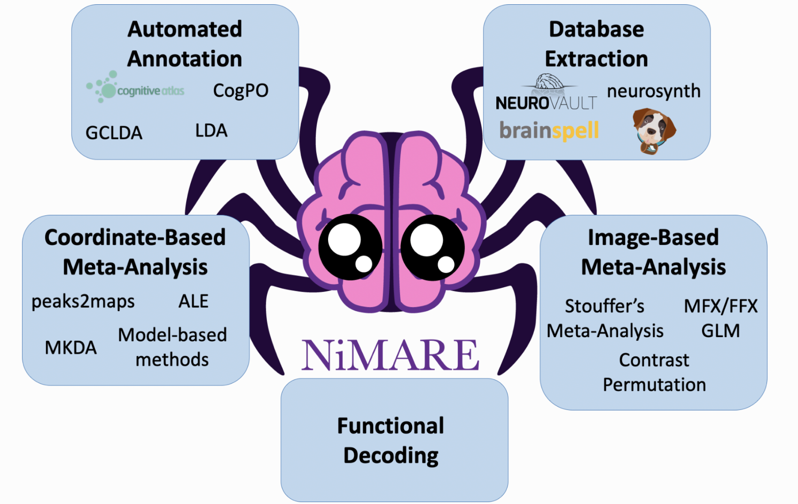
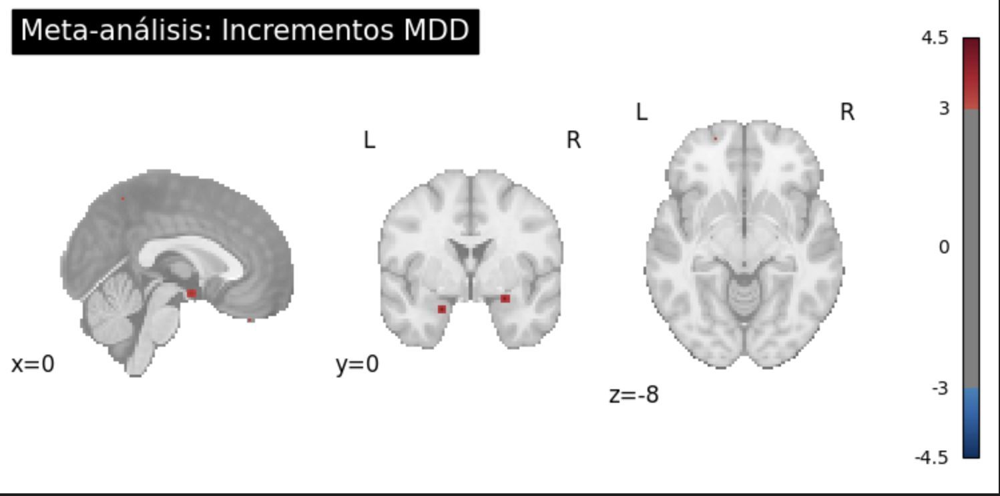
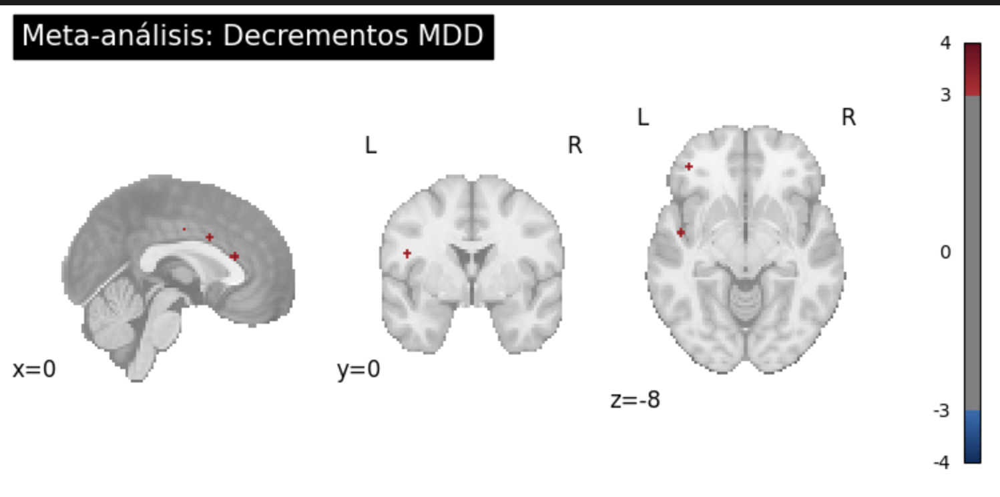
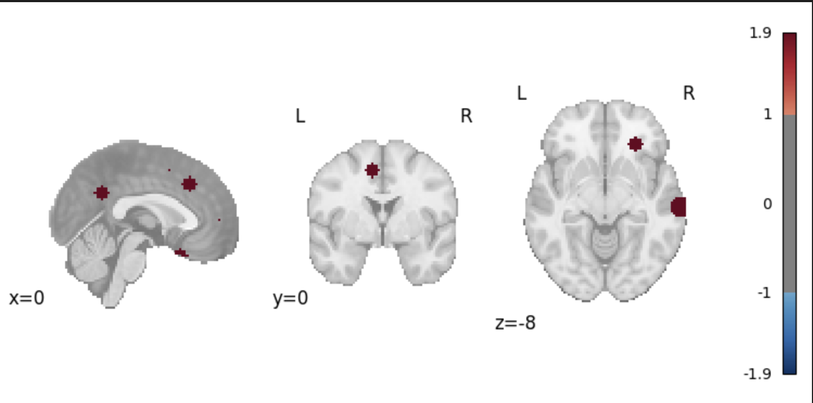

# Meta-Análisis de Alteraciones Neorulógicas y Funcionales en MDD 🧠
### Colaboración de Investigación | Dr. Guillén & Universidad de los Andes


 

## 📌 Descripción del Proyecto
Este repositorio documenta el desarrollo de un pipeline computacional para el meta-análisis de coordenadas cerebrales (CBMA) en pacientes con **Trastorno Depresivo Mayor (MDD)**. El objetivo es identificar convergencias estadísticas entre múltiples estudios para mapear biomarcadores estructurales y funcionales mediante algoritmos de vanguardia.

Bajo la supervisión del **Dr. Guillén**, este trabajo integra datos de resonancia magnética funcional (fMRI) y morfometría basada en vóxeles (VBM) para entender la firma biológica de la depresión.

---

## 🛠️ Procedimiento Técnico

El flujo de trabajo se divide en cuatro fases críticas ejecutadas mediante **NiMare** y **Nilearn**:

1.  **Curación de Datos (NiMADS Schema):** Extracción manual de coordenadas (MNI/Talairach) de literatura científica y estructuración en formato JSON.
2.  **Análisis Funcional (MKDA/ALE):** Ejecución de algoritmos para detectar picos de hiperactivación. 
    * *Resultado clave:* Localización de un pico significativo en el **Lóbulo Temporal Izquierdo/Ínsula** ($Z = 4.49$).
3.  **Análisis Estructural:** Evaluación de cambios volumétricos mediante MKDA Density.
    * *Hallazgo:* Identificación de tendencias de alteración prefrontal ($Z = 1.92$, filtrado con threshold manual de 1.0).
4.  **Visualización Científica:** Proyección de resultados en mapas ortogonales, Glass Brains y renderizado de superficie 3D.

---

## 📊 Galería de Resultados

### 1. Mapa Funcional (Incrementos)
*Identificación de picos de activación significativos mediante ALE.*
 
*Maximo Z-score: 3.9615771770477295*
*Pico máximo detectado en MNI: [ 54. -40.  38.]*

### 2. Mapa Funcional (Decremental)
*Identificación de picos de activación significativos mediante ALE.*
 
*Maximo Z-score: 4.489522933959961*
*Pico máximo detectado en MNI: [-48. -22. -28.]*

### 3. Mapa Estructural (Decremental)
*Identificación de picos de activación significativos mediante MKDA.*
 
*Maximo Z-score: 1.9193516969680786*
*Pico máximo detectado en MNI: [-58. -64.  24.]*

---

## 💡 Skills 

Este proyecto demuestra competencia técnica en áreas de alta demanda para neurociencia computacional y ciencia de datos:

* **Análisis Estadístico Espacial:** Modelado de incertidumbre espacial mediante Kernel Density Estimation (KDE).
* **Procesamiento de Imágenes Médicas:** Manejo de formatos NIfTI, transformaciones afines y sistemas de coordenadas MNI152.
* **Data Engineering:** Creación de ETLs para convertir datos de literatura científica en bases de datos relacionales/JSON para meta-análisis.
* **Visualización Científica Avanzada:** Uso de `Nilearn` para comunicar hallazgos complejos de forma intuitiva (Surface Mapping, Glass Brains).
* **Rigor Científico:** Manejo de correcciones por comparaciones múltiples (FWE/FDR) y validación de hipótesis nulas mediante simulaciones de Monte Carlo.

---

## 🚀 Cómo Reproducir este Estudio

1.  **Clonar el repositorio:**
    ```bash
    git clone [https://github.com/tu-usuario/DataAnalysisNimare.git](https://github.com/deleonpablo/DataAnalysisNimare.git)
    ```
2.  **Instalar dependencias:**
    ```bash
    pip install nimare nilearn matplotlib numpy
    ```
3.  **Ejecutar el Notebook:**
    Abre `Reporte.ipynb` en VS Code o Jupyter Lab para ver el pipeline completo paso a paso.

---

**Contacto & Colaboración**
* **Investigador:** Pablo De León Devia - [LinkedIn](https://www.linkedin.com/in/pablodeleonn)
* **Mentor:** Dr. Guillén Burgos - [LinkedIn](https://www.linkedin.com/in/felipeguillenmd)
* **Institución:** Universidad de los Andes | Ingeniería de Sistemas & Matemáticas
